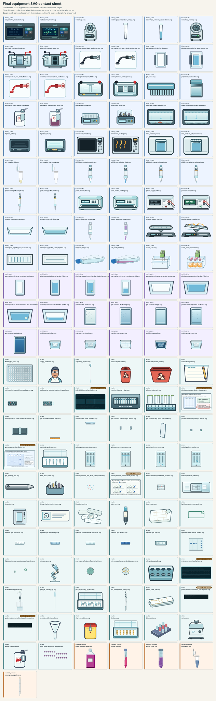

# Equipment SVG contact sheet (historical)

This labeled contact sheet preserves the 139-asset review snapshot from the
August 24, 2026 consistency sweep. It is historical evidence, not the current
equipment-tree review surface: the later variable-volume consolidation removed
retired pipette variants and established a former 135-SVG source tree. The
current ownership-repaired tree contains 132 authored SVGs.

Use the current [production-art review workflow](USAGE.md#equipment-svg-visual-review)
to build the searchable 132-source page, then judge scene appearance through
its six real-consumer captures. The
[frozen-tree validation record](active_plans/reports/svg_m12_validation_record.md),
[built-consumer capture record](active_plans/reports/svg_m12_consumer_capture.md), and
[equipment construction kit](figures/equipment_kit/README.md) remain technical
and historical construction evidence rather than current human visual approval.

[figures/final_equipment_contact_sheet.svg](figures/final_equipment_contact_sheet.svg)
is the full-resolution historical figure. Open that link directly to zoom or
download it without rasterizing the labels. The figure is self-contained and
has no external image dependencies.

The sheet groups assets by authored behavior and labels every source folder and
filename. Seven result composites are visibly marked `DEFERRED / BYTE-PRESERVED`;
their migration to application-owned result interfaces remains in
[TODO.md](TODO.md) and [ROADMAP.md](ROADMAP.md).

